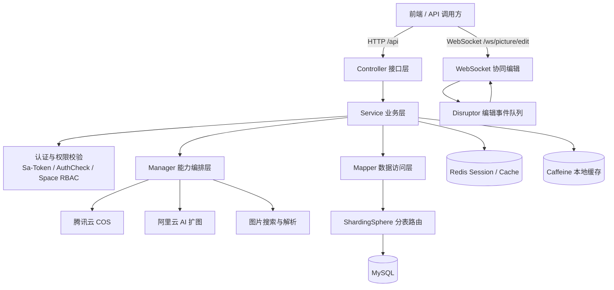
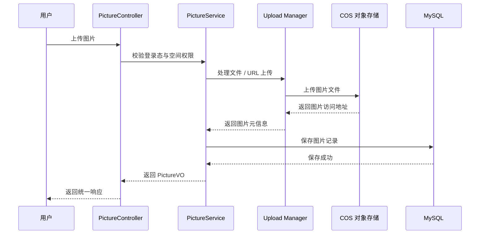

# Hrup Picture Backend

Hrup Picture Backend 是一个基于 Spring Boot 的企业级图片管理与协作图库后端服务，提供用户体系、图片上传与审核、空间管理、成员权限、空间数据分析、以图搜图、按颜色搜索、AI 扩图和 WebSocket 协同编辑等能力。

项目适合作为图片素材平台、团队图库、云端相册、设计协作工具等业务的后端基础服务。

## 功能特性

- 用户注册、登录、退出、登录态获取、管理员用户管理
- 图片本地上传、URL 上传、批量上传、删除、编辑、审核与分页查询
- 公共图库与私有空间隔离，支持空间等级、容量限制和空间成员管理
- 基于 Sa-Token 的空间级 RBAC 权限控制
- 图片标签分类、以图搜图、主色提取与按颜色相似度检索
- 空间用量、分类、标签、大小、用户上传行为和排行分析
- WebSocket 实时协同编辑图片，使用 Disruptor 处理编辑事件
- 腾讯云 COS 对象存储接入
- 阿里云 AI 扩图任务创建与查询
- Redis Session、缓存与登录态存储
- ShardingSphere 动态分表，支持按空间维度扩展图片表
- Knife4j 接口文档

## 技术栈

| 分类 | 技术 |
| --- | --- |
| 开发语言 | Java 8 |
| 基础框架 | Spring Boot 2.7.6 |
| Web | Spring MVC, WebSocket |
| ORM | MyBatis-Plus 3.5.9 |
| 数据库 | MySQL |
| 缓存与会话 | Redis, Spring Session, Caffeine |
| 权限认证 | Sa-Token |
| 分库分表 | Apache ShardingSphere JDBC |
| 对象存储 | Tencent Cloud COS |
| AI 能力 | 阿里云 AI 扩图 |
| 文档 | Knife4j |
| 工具库 | Hutool, Lombok, Jsoup |

## 系统架构



## 模块结构

```text
src/main/java/com/hrup/hruppicturebackend
├── annotation        # 自定义注解
├── aop               # 权限校验切面
├── api               # 第三方 API 封装
├── common            # 通用响应、分页、删除请求
├── config            # Spring、MyBatis、COS、JSON、跨域等配置
├── constant          # 常量定义
├── controller        # HTTP API 控制器
├── exception         # 异常码、业务异常、全局异常处理
├── manager           # 文件、COS、权限、分表、上传、WebSocket 等能力编排
├── mapper            # MyBatis-Plus Mapper
├── model             # DTO、Entity、Enum、VO
├── service           # 业务接口与实现
└── utils             # 颜色转换与相似度工具
```

## 核心业务流程



## 接口概览

服务默认端口为 `8080`，接口统一前缀为 `/api`。

| 模块 | 路径前缀 | 说明 |
| --- | --- | --- |
| 健康检查 | `/api/health` | 服务状态检查 |
| 用户 | `/api/user` | 注册、登录、退出、用户管理、会员兑换 |
| 图片 | `/api/picture` | 上传、编辑、删除、审核、搜索、AI 扩图 |
| 空间 | `/api/space` | 空间创建、更新、查询、等级配置 |
| 空间成员 | `/api/spaceUser` | 空间成员添加、移除、角色编辑 |
| 空间分析 | `/api/space/analyze` | 用量、分类、标签、大小、用户、排行分析 |
| 文件测试 | `/api/file` | 管理员文件上传下载测试接口 |
| 协同编辑 | `/ws/picture/edit` | 图片协同编辑 WebSocket |

Knife4j 文档启动后可访问：

```text
http://localhost:8080/api/doc.html
```

## 环境要求

- JDK 8
- Maven 3.6+
- MySQL 5.7+ / 8.x
- Redis 5+
- 可选：腾讯云 COS 账号
- 可选：阿里云 DashScope / AI 扩图 API Key

## 本地启动

1. 创建数据库并导入表结构：

```bash
mysql -u root -p < sql/create_table.sql
```

2. 新建本地配置文件：

```text
src/main/resources/application-local.yml
```

3. 按需补充配置：

```yaml
spring:
  datasource:
    url: jdbc:mysql://localhost:3306/hrup_picture?useUnicode=true&characterEncoding=utf8&serverTimezone=Asia/Shanghai
    username: root
    password: your_password
  redis:
    host: localhost
    port: 6379
    password:
  shardingsphere:
    datasource:
      hrup_picture:
        url: jdbc:mysql://localhost:3306/hrup_picture?useUnicode=true&characterEncoding=utf8&serverTimezone=Asia/Shanghai
        username: root
        password: your_password

cos:
  client:
    host: your_cos_host
    secretId: your_secret_id
    secretKey: your_secret_key
    region: your_region
    bucket: your_bucket

aliYunAi:
  apiKey: your_api_key
```

4. 启动服务：

```bash
mvn spring-boot:run
```

5. 访问健康检查：

```text
http://localhost:8080/api/health
```

## 打包部署

```bash
mvn clean package -DskipTests
java -jar target/hrup-picture-backend-0.0.1-SNAPSHOT.jar
```

生产环境建议通过外部配置文件或环境变量注入数据库、Redis、COS 和 AI API Key，避免将敏感信息提交到代码仓库。

## 权限模型

项目包含两类权限控制：

- 管理员权限：通过 `@AuthCheck(mustRole = UserConstant.ADMIN_ROLE)` 控制用户管理、图片审核、空间管理等后台能力。
- 空间权限：通过 `@SaSpaceCheckPermission` 控制空间成员在私有空间内的图片查看、上传、编辑、删除和成员管理权限。

空间角色与权限配置位于：

```text
src/main/resources/biz/spaceUserAuthConfig.json
```

## 数据与存储

- 图片、用户、空间、空间成员等业务数据存储在 MySQL。
- 登录态和 Session 存储在 Redis。
- 热点查询可使用 Caffeine 本地缓存。
- 图片文件上传至腾讯云 COS。
- 私有空间图片表支持按 `spaceId` 动态分表。

## 注意事项

- `application-local.yml`、`application-prod.yml` 已在 `.gitignore` 中忽略，请勿提交真实密钥。
- `application.yml` 中仅保留公共配置和占位配置。
- 使用 ShardingSphere 时，普通数据源和分片数据源的数据库连接信息需要保持一致。
- WebSocket 协同编辑依赖用户登录态，连接前会进行握手校验。

## 开源说明

本仓库仅包含后端服务代码。请根据实际业务场景补充前端项目、部署脚本和 CI/CD 流程。
